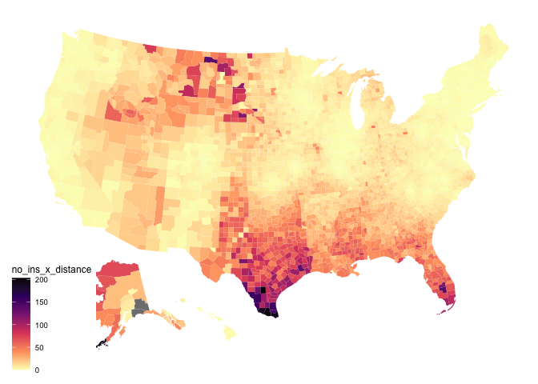

## How many women live far from an abortion clinic? 

With Roe in place, **18,341** women live more than 300 mi from an abortion clinic. 

If Roe is overturned, it's almost certain that **14,514,473** will live more than 300 mi from the nearest abortion clinic operating without restrictions.

It is possible and likely that number could be closer to  **29,931,527** if certain states impose restrictions.

## Average distance to nearest clinic

This is how things look now, with every clinic's operations protected by the Roe v. Wade decision.

The average distance to the nearest clinic for each county is **61.6247959 mi**.

<!-- -->
If Roe v. Wade is overturned, certain clinics may be shut down by laws in states that choose to do so.

For each county, distance (mi) was computed to the nearest abortion clinic in a state without trigger laws or restrictions.

Average distance is **175.8880956 mi** to the nearest clinic if Roe is overturned.
<!-- -->
<!-- -->

## Demographics

Average % women in poverty in all counties: **15.9992864**

#### % Women in poverty by distance from nearest Post-Roe clinic

| quintile of distance from nearest clinic (nth)| % women in poverty|   n|
|----------------------------------------------:|------------------:|---:|
|                                              1|           12.71256| 628|
|                                              2|           15.93027| 627|
|                                              3|           16.01257| 628|
|                                              4|           16.52189| 628|
|                                              5|           18.81456| 629|

<!-- -->

Average % women without insurance in all counties: **8.5780812**

#### % Women without insurance by distance from nearest Post-Roe clinic

| quintile of distance from nearest clinic (nth)| % women without health insurance|   n|
|----------------------------------------------:|--------------------------------:|---:|
|                                              1|                         5.973669| 628|
|                                              2|                         7.709715| 627|
|                                              3|                         7.974740| 628|
|                                              4|                         9.428823| 628|
|                                              5|                        11.796952| 629|

<!-- -->

